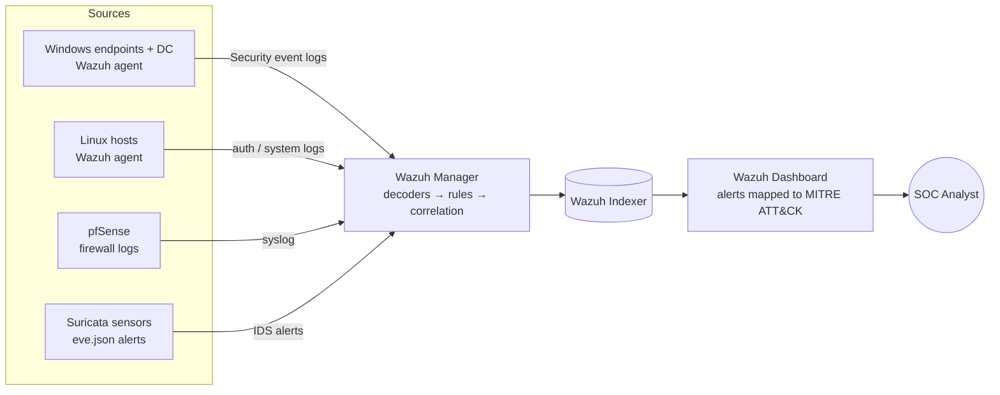

# SOC Platform & Attack Simulation

> A virtualized enterprise network with a full detection stack — **pfSense, Active Directory, Suricata and Wazuh** — validated against **15 Red Team / Blue Team scenarios**, with every detection mapped to **MITRE ATT&CK**.


---

## Table of contents

- [Why this project](#why-this-project)
- [Architecture](#architecture)
- [Network segmentation](#network-segmentation)
- [Detection pipeline](#detection-pipeline)
- [Attack scenarios](#attack-scenarios)
- [Detection engineering](#detection-engineering)
- [Lessons learned](#lessons-learned)
- [Tech stack](#tech-stack)
- [Author](#author)

---

## Why this project

A SOC is only as good as what it actually detects. Deploying Wazuh and Suricata is the easy part; knowing whether they would catch a real intrusion is the hard part.

This lab answers that question by playing **both sides**:

- **Red Team:** run realistic attacks against a small-company network — phishing for initial access, Active Directory abuse, lateral movement, attacks on exposed web services.
- **Blue Team:** investigate every resulting alert in Wazuh, rebuild the attack timeline from the logs, identify the ATT&CK techniques used, and fix the detection gaps found along the way.

## Architecture


The whole environment runs on **VMware** and mirrors a typical small enterprise: a perimeter firewall, a DMZ exposing a public web application, an internal Active Directory domain with Windows workstations, a deliberately vulnerable Linux host, and a dedicated SOC segment.

## Network segmentation

**pfSense** is the central firewall and routes between all zones:

| Zone | Assets | Role in the lab |
|---|---|---|
| **DMZ** | Web server (Docker-hosted web application) | Internet-facing target, exposed to external attackers |
| **Local subnet** | Active Directory Domain Controller, 4 Windows workstations (domain-joined), Metasploitable VM | Internal enterprise network and main attack surface |
| **SOC** | Wazuh server (manager, indexer, dashboard) | Centralized collection, correlation and alerting, used by the SOC analyst |
| **Internet** | External attacker | Source of web attacks and phishing campaigns |

Two **Suricata** sensors watch the traffic crossing the firewall: one on the **DMZ** link and one on the **local subnet** link, so both external web attacks and internal network activity are inspected.

## Detection pipeline



| Source | Collection method | What it reveals |
|---|---|---|
| Windows workstations & DC | Wazuh agent (Windows Security Event Log) | Logons, privilege use, process creation, account changes, Kerberos activity |
| Linux hosts | Wazuh agent | Authentication attempts, system changes |
| pfSense | Syslog | Allowed / blocked connections between zones |
| Suricata | `eve.json` alerts | Signature-based detection of network attacks, scans and exploits |

Key Windows events monitored:

| Event ID | Meaning | Typical use in detection |
|---|---|---|
| 4624 / 4625 | Successful / failed logon | Brute force, password spraying, lateral movement |
| 4672 | Special privileges assigned | Privileged account usage |
| 4688 | Process creation | Malicious command execution (e.g. encoded PowerShell) |
| 4720 | User account created | Persistence through new accounts |
| 4769 | Kerberos service ticket requested | Kerberoasting |
| 7045 | Service installed | Persistence, remote execution tools |
| 1102 | Audit log cleared | Defense evasion |

## Attack scenarios

The 15 scenarios follow the kill chain, from initial access to impact. Initial access on the Windows workstations is obtained through **phishing**; the web server in the DMZ and the Metasploitable host are attacked directly over the network.

<!-- TODO: fill in your 15 real scenarios. Keep one row per scenario. -->

| # | Scenario | Tactic | ATT&CK technique | Target | Detected by | Detected at first run? |
|---|---|---|---|---|---|---|
| 1 | | | | | | |
| 2 | | | | | | |
| 3 | | | | | | |
| 4 | | | | | | |
| 5 | | | | | | |
| 6 | | | | | | |
| 7 | | | | | | |
| 8 | | | | | | |
| 9 | | | | | | |
| 10 | | | | | | |
| 11 | | | | | | |
| 12 | | | | | | |
| 13 | | | | | | |
| 14 | | | | | | |
| 15 | | | | | | |

## Detection engineering

For each scenario, the Blue Team workflow was:

1. **Alert triage** — review the alert in the Wazuh dashboard and its ATT&CK mapping.
2. **Log correlation** — pivot across Windows events, Suricata alerts and pfSense logs for the same hosts and time window.
3. **Timeline reconstruction** — rebuild the sequence of attacker actions from initial access onward.
4. **Response decision** — define the containment action an analyst would take (isolate the host, disable the account, block the IP).
5. **Gap fixing** — when an attack went undetected, identify what was missing (log source, audit policy, rule) and fix it.

<!-- TODO: add 1 or 2 custom Wazuh rules you wrote, e.g. a brute-force correlation rule. -->

```xml
<!-- Example: place your custom rule from /var/ossec/etc/rules/local_rules.xml here -->
```

## Lessons learned

<!-- TODO: replace with your own findings. This section is what convinces a SOC recruiter. -->

- Which attacks were **not** detected at first, and why (missing audit policy, missing log source, no matching rule).
- What was changed to detect them.
- The limits observed: signature-based IDS does not see unknown attacks or encrypted payloads.

## Tech stack

| Category | Tools |
|---|---|
| Virtualization | VMware |
| Firewall / routing | pfSense |
| Identity | Windows Server — Active Directory Domain Services |
| Network detection | Suricata (IDS) |
| SIEM / XDR | Wazuh (manager, indexer, dashboard, agents) |
| Targets | Windows workstations, Metasploitable, Docker-hosted web application |
| Framework | MITRE ATT&CK |

## Author

**Ayoub ELMORTAJI** — Engineering student in Cybersecurity & Cloud Computing, ENSAM Casablanca

[GitHub](https://github.com/AyoubElmortaji)
